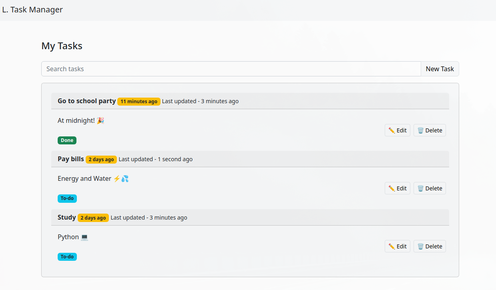

# Laravel Task Manager

This is a task manager built with **Laravel**, **Blade**, **Vue**, **Sail** (Docker) and **MySQL**. The project allows you to create, edit, and delete tasks, as well as search for them. The project uses Laravel's Resource Controller to create a *RESTful API* for the backend, and Vue for the frontend.

## Installation

#### Clone the repository:
`git clone https://github.com/GabrielTSants/LaravelTaskManager.git`
#### Change into the project directory:
`cd LaravelTaskManager`
#### Copy the .env.example file to .env:

`cp .env.example .env`

#### Start the Docker containers:

`./vendor/bin/sail up -d`

#### Run the docker
`
docker run --rm \
    -u "$(id -u):$(id -g)" \
    -v $(pwd):/var/www/html \
    -w /var/www/html \
    laravelsail/php81-composer:latest \
    composer install --ignore-platform-reqs;
`
### Generate the key
`./vendor/bin/sail php artisan key:generate`

### Migrate the database on another terminal
`./vendor/bin/sail php artisan migrate`

### Run the docker server
`./vendor/bin/sail up`

Visit http://localhost in your web browser to view the application.

You can also access http://localhost:8080 to access **PHPMyAdmin**.

### Usage

The application allows you to create, edit, and delete tasks. To create a new task, click on the "New Task" button in the top right-hand corner of the page. To edit an existing task, click on the task's title, and then click on the "Edit Task" button. To delete a task, click on the "Delete Task" button on the task's page.

You can also search for tasks by entering a search query in the search bar at the top of the page.

## Routes
The following routes are available in the application:

* GET / - Displays the list of tasks
* GET /task/create - Displays the form to create a new task
* POST /task - Creates a new task
* GET /task/{task}/edit - Displays the form to edit an existing task
* PUT/PATCH /task/{task} - Updates an existing task
* DELETE /task/{task} - Deletes an existing task
* GET /tasks/search - Searches for tasks
* GET /api/task-index/{query?} - Searches for tasks via API
Controllers

## Objects and Controllers

**TaskController** - Handles the creation, editing, and deletion of tasks, as well as the search functionality.
Models
The following model is available in the application:

**Task** - Represents a task in the application.

## Database
The application uses a MySQL database, with the following schema:

`
sql
Copy code
CREATE TABLE 'tasks' (
  'id' bigint unsigned not null auto_increment primary key,
  'title' varchar(255) not null,
  'description' varchar(255) null,
  'status' enum('To-do', 'Done') not null default 'To-do',
  'created_at' timestamp null,
  'updated_at' timestamp null
);
`

## Vue Live Search and Functions
The *TaskList.vue* component in this project includes a live search feature that allows users to search for tasks as they type. This feature is implemented using **Vue's** v-model directive and the @input event.

Additionally, this component includes various Vue functions to perform tasks such as getting tasks from the server, searching tasks, and deleting tasks. These functions are defined within the methods object of the Vue component.

Overall, the Vue framework makes it easy to build dynamic and responsive user interfaces with powerful features like live search and custom functions.
## Unit Tests
This repository includes unit tests for the Task model and its corresponding controller. These tests are located in the *Tests\Feature\TaskTest* class.

The *TaskTest* class extends the *TestCase* class provided by **Laravel**, and uses the *RefreshDatabase* trait to automatically refresh the database between tests. This ensures that each test is run in isolation and has its own clean database state.

The class includes three tests:

* `it_can_create_a_task()`: This test verifies that a new task can be created by sending a POST request to the task.store route with valid data. It checks that the response has no errors and that the data was successfully stored in the database.

* `it_can_update_a_task()`: This test verifies that an existing task can be updated by sending a PUT request to the task.update route with valid data. It checks that the response has no errors and that the data was successfully updated in the database.

* `it_can_delete_a_task()`: This test verifies that an existing task can be deleted by sending a DELETE request to the task.destroy route. It checks that the response has no errors and that the data was successfully deleted from the database.

These tests provide a good coverage of the basic CRUD operations for the Task model and can be used as a starting point for further testing.

